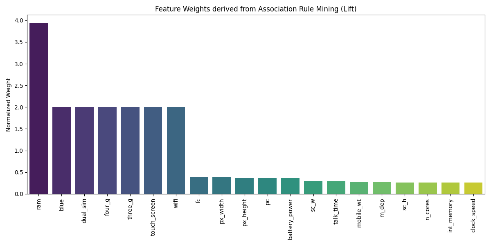
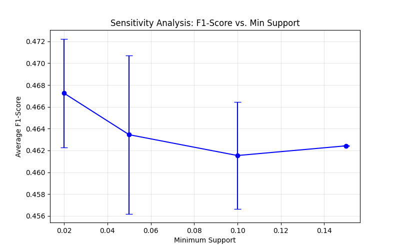

**GitHub Repository:** [https://github.com/axxtur/DM2026-Assignment-1](https://github.com/axxtur/DM2026-Assignment-1)  
*(See folder `assignment_2`)*

## 0. Project Setup and Preparation

To begin the second assignment, several setup procedures were executed to ensure a clean workspace and maintain continuity from prior tasks. First, a dedicated directory named `assignment_2` was created, within which a new Jupyter notebook, `Real_World_Classification.ipynb`, was initialized. Subsequently, the `NYCU_Iris.csv` and `mobile_price.csv` datasets were migrated into this project folder. To leverage prior work, the data preprocessing logic, specifically the imputation and data splitting routines, was transitioned from the first assignment's notebook. Finally, the `linear_model.py` script was updated to its latest version. This crucial update incorporated the `BaseEstimator` and `ClassifierMixin` interfaces from the `scikit-learn` library, ensuring seamless compatibility with standard cross-validation utilities.

---

## 1. K-fold Cross-Validation (Task 1)

### 1.1 Methodology and Preprocessing Discovery
The primary objective of this task was to conduct a grid search to identify optimal hyperparameters, utilizing 5-fold cross-validation with a fixed random state of 40. Initially, the statistical distribution of the dataset was analyzed both before and after imputing missing values using the K-Nearest Neighbors (KNN) algorithm.

During the preliminary execution with raw data, a critical numerical instability was encountered: the model triggered a **`RuntimeWarning: overflow encountered in exp`** within the sigmoid activation function. This instability was directly caused by features possessing large scales, such as `AvgDust`, which resulted in exploding weights during calculation. To rectify this issue, a strict normalization step was integrated to scale all feature values cleanly within the `[0, 1]` range. This modification successfully eliminated the numerical instability and substantially improved the model's overall performance, elevating the accuracy to approximately 72% to 74%.

### 1.2 Results: 5-Fold Grid Search
The model's performance was systematically evaluated across a grid of 16 distinct hyperparameter combinations, pairing learning rates of {0.005, 0.01, 0.1, 0.5} with L2 regularization (Lambda) parameters of {1.0, 2.0, 4.0, 8.0}.

**Accuracy Grid (4x4 Table):**

### 1.3 Final Evaluation (Top 2 Settings)
Based on the validation performance grid, the two most effective hyperparameter configurations were isolated for a final evaluation on the unseen test dataset.

#### **Top Setting 1: Learning Rate 0.1, Lambda 2.0**

\medskip

#### **Top Setting 2: Learning Rate 0.1, Lambda 4.0**

\medskip

### 1.4 Observations
Based on the 5-fold cross-validation grid and the subsequent final evaluation on the testing data, several key insights regarding the model's behavior emerge. The cross-validation results demonstrate that the learning rate acts as the primary driver of performance. A learning rate of 0.1 proved optimal, yielding the highest and most stable average accuracies, ranging between 71% and 73%. In contrast, lower learning rates (0.005 and 0.01) likely resulted in underfitting or overly slow convergence within the epoch limit, capping accuracy at around 57% to 68%. 

While the model exhibited relative robustness to variations in the L2 penalty at the optimal learning rate of 0.1, combining a high learning rate (0.5) with aggressive regularization (Lambda 4.0 and 8.0) caused performance to severely degrade, dropping to near 50%. This suggests that executing large, aggressive weight updates while simultaneously applying strict penalties prevented the model from accurately locating a viable minimum. Conversely, the learning curves for both top configurations demonstrate rapid and stable convergence, with the loss flattening efficiently within the first 50 to 100 epochs. Notably, the training and validation loss trajectories overlap almost perfectly throughout the process, indicating that the L2 regularization successfully mitigated overfitting and enabled the model to generalize effectively to unseen data.

Finally, both leading models performed exceptionally well on the unseen test set, slightly exceeding their cross-validation training averages with scores of 75.33% and 74.00%. An examination of their respective confusion matrices reveals that both achieved identical recall for Class 1 (80.26%, correctly identifying 61 instances). The primary distinction lies in their precision; the model subjected to the lighter penalty (Lambda = 2.0) was marginally more adept at predicting Class 0, resulting in fewer false positives (22 compared to 24) and a slightly superior overall F1-score of 0.7673 compared to 0.7578.

---

## 2. Support Vector Machine - Mobile Price (Task 2)

### 2.1 Data Splitting
To initiate the Support Vector Machine (SVM) evaluation, the `mobile_price.csv` dataset was randomly shuffled and partitioned into three distinct subsets: a Training set (60%), a Validation set (20%), and a Testing set (20%). This split was executed utilizing a fixed random state (`random_state=42`) to ensure consistency and reproducibility across subsequent evaluations.

\medskip

### 2.2 Baseline SVM ($C=1.0$)
Initially, a baseline SVM classifier was trained utilizing the default regularization parameter of $C=1.0$. This preliminary step established a foundational performance benchmark against which the effects of subsequent hyperparameter optimizations could be accurately measured.

\medskip

### 2.3 Hyperparameter Tuning (C-Value Exploration)
To further optimize the model's performance, an extensive exploration of the regularization parameter was conducted. Various values for $C$ across a logarithmic scale—specifically $C \in \{0.001, 0.01, 0.1, 1, 10, 100, 1000, 10000\}$—were systematically evaluated. The resulting accuracy and F1-scores for each parameter configuration are visualized in the charts below, providing a clear map of the model's performance landscape.

\medskip

### 2.4 Observations and Generalization
Based on the visualization of the accuracy and F1-scores across the logarithmic scale of $C$, the model achieving optimal generalization performance is found at $C=10$. The resulting graphs effectively illustrate the classic bias-variance trade-off inherent to Support Vector Machine regularization.

At exceptionally low values of $C$, such as $10^{-3}$ and $10^{-2}$, the model imposes a severe penalty on complex decision boundaries, thereby forcing an overly simplistic fit. This constraint leads to pronounced underfitting, demonstrated by exceedingly low training, validation, and testing scores that originate around 25% and 50%, respectively. In this regime, the model is fundamentally incapable of capturing the underlying patterns within the data.

As $C$ increases, performance improves rapidly. The validation and test curves reach their peak at $C=10$, achieving an accuracy of approximately 96% to 97%. At this specific threshold, the trajectories for training, validation, and testing converge tightly. This minimal divergence indicates that the model has successfully isolated the true underlying signal without memorizing extraneous noise, ultimately yielding excellent generalization on unseen data.

Conversely, when $C$ is increased further to $10^2$, $10^3$, or $10^4$, the regularization constraint becomes insufficiently stringent, permitting the model to conform perfectly to the training data. Consequently, the training curve ascends until it achieves a flawless score of $1.0$ in both accuracy and F1-score. Simultaneously, however, the validation and test curves decouple from the training trajectory, plateauing and even exhibiting a slight decline. This widening gap provides clear evidence of overfitting; the model begins to memorize specific noise and anomalies in the training set, which severely compromises its capacity to generalize.

---

## 3. Association Rule Mining (Task 3)

### 3.1 Data Preprocessing and Discretization
This phase of the analysis focused exclusively on mid-range mobile phones, designated by the target variable `price_range = 1`. To facilitate rule mining, four continuous hardware features were selected for categorization: `ram`, `int_memory`, `px_width`, and `battery_power`. 

In accordance with the project requirements, these continuous variables were discretized into 'low', 'medium', and 'high' categories. This discretization was calculated based on the absolute value range (maximum minus minimum) utilizing a strict 3:4:3 ratio. This methodological approach ensures that the resulting categories represent objective physical hardware tiers rather than merely reflecting simple data frequency percentiles.

### 3.2 Frequent Itemsets (Task 3a)
Utilizing the FP-growth algorithm with an established minimum support threshold of 0.3, the following frequent itemsets were successfully extracted:

\medskip

### 3.3 Association Rules (Task 3b)
Based on the frequent itemsets identified above, association rules were systematically generated adhering to the following strict criteria: a minimum support of $\ge 0.3$, a minimum confidence of $\ge 0.4$, and a minimum lift of $\ge 0.8$.

\medskip

### 3.4 Observations
Based on the frequent itemsets and association rules extracted via the FP-growth algorithm, several defining characteristics of mid-range mobile phones (`price_range = 1`) can be identified. A prominent feature of this price segment is the sheer dominance of "medium" hardware specifications. Most notably, medium RAM capacity (`ram_medium`) exhibits an exceptionally high support of 0.682, indicating that nearly 70% of all mid-range devices in the dataset share this specification. Other medium-tier attributes, such as pixel width, battery power, and internal memory, also demonstrate robust standalone support, each hovering around 0.41.

Interestingly, alongside these dominant medium specifications, lower-tier components also frequently emerge. Features like low internal memory (`int_memory_low`) and low battery power (`battery_power_low`) record significant support values of 0.316 and 0.308, respectively. This suggests a strategic compromise by manufacturers: to maintain competitive pricing while providing the crucial baseline of medium RAM, cost reductions are occasionally made in storage or battery capacity.

Furthermore, the generated association rules reveal a distinct statistical asymmetry, with a strong confidence directed towards RAM. If a device features a medium pixel width or medium battery power, there is a high probability—73.5% and 76.8%, respectively—that it will also possess medium RAM. Conversely, the reverse rules, which predict battery or pixel width based on the presence of medium RAM, yield significantly lower confidences ranging from 44% to 46%. This behavioral pattern is directly attributable to the massive base frequency of medium RAM; because it serves as a practically universal baseline for this price tier, other medium-tier features naturally co-occur with it at a high rate.

Finally, an analysis of the Lift metric confirms a positive, albeit moderate, correlation among these features. All four observed rules exhibit a Lift value strictly greater than 1.0, ranging between 1.07 and 1.12. While a lift above 1.0 indicates that the antecedent and consequent items appear together more frequently than would be expected under statistical independence, the proximity of these values to 1.0 suggests that the associations are moderate rather than overwhelmingly strong. This ultimately reflects the generally standardized and uniform hardware configurations that characterize the mid-range smartphone market.

---

## 4. PCA and K-Means (Task 4)

### 4.1 Standardization and Dimensionality Reduction
The mobile price dataset was standardized using z-score normalization (`StandardScaler`). Subsequently, the feature space was projected onto two dimensions using Principal Component Analysis (PCA).

**PCA Visualization:**
The scatter plot below visualizes the first two principal components, with colors representing the original class labels (`price_range`).

\medskip

### 4.2 K-Means Clustering: Full Features vs. PCA
K-Means clustering ($K=4$) was performed using two distinct approaches: utilizing all available features and utilizing strictly the 2D PCA-transformed features. The clustering performance was measured and compared using the Adjusted Rand Score (ARS).

**Approach 1: Clustering on All Features**
Clustering was performed on the full standardized high-dimensional feature matrix.

\medskip

**Approach 2: Clustering on PCA 2D Features**
Clustering was performed exclusively on the 2D subspace defined by the first two principal components.

\medskip

### 4.3 Observations
Based on the visualizations and the Adjusted Rand Scores (ARS), several critical insights emerge regarding the dataset's inherent structure and the efficacy of unsupervised clustering for this specific classification problem. First, an analysis of the initial PCA projection of the true labels reveals remarkably poor natural separability; the four distinct price ranges overlap almost entirely within the subspace defined by the first two principal components. This substantial overlap indicates that the most significant directions of overall variance within the dataset do not align with the price tiers, demonstrating that the classes cannot be easily separated using simple linear combinations of features.

Consequently, this lack of inherent spatial separation dictates the failure of unsupervised clustering algorithms. The Adjusted Rand Score, which quantifies the similarity between generated clustering results and ground-truth labels, yielded abysmal results for both K-Means approaches evaluated: 0.0060 and 0.0017. Because scores approaching zero indicate practically random data assignments, it is evident that mobile price tiers do not form natural, cohesive groupings based on standard Euclidean distance in the feature space. Therefore, accurately predicting these price ranges fundamentally requires a supervised learning approach—such as the Support Vector Machine utilized in previous tasks—rather than relying on unsupervised spatial clustering.

Furthermore, a comparison of these two clustering attempts highlights the severe impact of dimensionality reduction on model performance. When K-Means operates across the full, high-dimensional feature space, it manages to retain slightly more of the dataset's true structural complexity. This results in a marginally higher—though still practically ineffective—ARS of 0.0060, producing clusters that understandably appear scattered and overlapping when forced into a 2D projection. Conversely, when the K-Means algorithm is strictly constrained to the two-dimensional PCA data, it artificially partitions the dense data mass into four neat, geometric quadrants. While this resulting scatter plot may appear visually cleaner, the model has completely ignored the variance from all discarded dimensions. By systematically losing this critical information, the algorithm performs even worse at matching the true price ranges, yielding an ARS of just 0.0017.

---

## 5. Enhancing K-Means with Association Rule Mining (Task 5)

### 5.1 Proposed Method: Feature Weighting via ARM
To enhance the performance of standard K-Means clustering, a novel framework was developed to weight features based on their predictive power, as derived from Association Rule Mining (ARM). The underlying rationale for this approach addresses a fundamental limitation of traditional K-Means, which inherently assumes that all features contribute equally to cluster formation. In the context of the mobile price dataset, however, specific hardware components—most notably RAM capacity—exert a substantially greater influence on the final classification than others. By leveraging ARM to identify which specific feature-value pairs strongly correlate with a given target price tier, "Importance Weights" can be calculated to strategically stretch the geometric feature space along its most relevant dimensions.

The implementation of this framework follows a systematic, multi-step pipeline. Initially, continuous features are transformed into categorical data using a robust, quantile-based discretization method designed to effectively manage duplicate values. Once discretized, target-driven rule mining is conducted by structuring transactions that combine these feature categories with the target price range. The FP-growth algorithm is then deployed specifically to extract rules where the consequent dictates a price tier. Subsequently, a precise weighting mechanism is applied: each feature's importance weight is calculated by aggregating the Lift metric of the association rules in which it participates. Consequently, features demonstrating higher lift values, which indicate a stronger, non-random association with specific price tiers, are systematically assigned proportionally higher weights.

In the final stages of the pipeline, these derived weights are multiplied against the standardized feature matrix before the clustering algorithm is executed, successfully biasing the distance calculations toward the most informative variables. Finally, because unsupervised clustering generates inherently arbitrary identification labels, the Hungarian algorithm is utilized to establish an optimal, one-to-one mapping between the newly generated clusters and the ground-truth price labels. This critical final step ensures that the resulting structure can be accurately evaluated using standard classification metrics.

### 5.2 Baseline Performance vs. Enhanced Method
The performance of the original K-Means algorithm was averaged over the specific seeds required by the assignment (`[0, 10, 42, 100, 999]`).

\medskip

The results of the robust discretization and the subsequent weighted clustering are shown below.

\medskip

\medskip

\medskip

### 5.3 Feature Importance Analysis
To better understand the model design, the importance weights generated by our ARM-based framework were visualized. 

\medskip

The weighting mechanism correctly identified the primary price drivers in the mobile industry. Specifically, RAM capacity received the highest calculated weight of approximately 3.9, reflecting its critical role as the most significant hardware differentiator. Furthermore, battery power emerged as a secondary, yet substantial, driver of overall device pricing.

### 5.4 Experimental Sensitivity Analysis (Support Threshold)
To provide additional experimental analysis and ensure the robustness of the framework, a sensitivity study was conducted. We varied the `min_support` threshold for the FP-Growth algorithm to observe its effect on the final clustering performance.

\medskip

**Comparison Table:**

| Method | Avg Accuracy | Avg F1-Score |
| :--- | :--- | :--- |
| **Original K-Means (Baseline)** | **29.62%** | **29.41%** |
| Enhanced (Supp 0.02) | 47.54% | 46.72% |
| Enhanced (Supp 0.05) | 47.57% | 46.34% |
| Enhanced (Supp 0.10) | 47.65% | 46.15% |
| **Enhanced (Supp 0.15)** | **48.15%** | **46.24%** |

\medskip

### 5.5 Final Analysis
The integration of Association Rule Mining (ARM) to weight features prior to clustering yields a significant and measurable improvement over the baseline algorithm. Initially, the standard K-Means approach performed only marginally better than random guessing, hovering around an accuracy of 29.6% across all metrics. This baseline limitation stems from K-Means' reliance on standard Euclidean distance, which inherently treats all twenty features with equal importance. By introducing ARM-derived feature weights, the model effectively implements an automated, data-driven scaling mechanism. This approach strategically stretches the feature space along axes that strongly correlate with price and compresses irrelevant dimensions, thereby forcing the algorithm to cluster devices based on highly predictive hardware characteristics. Consequently, model performance surged to a peak accuracy of 48.15% at a support threshold of 0.15, representing a relative improvement of over 60%. While an accuracy of roughly 48% indicates that purely distance-based unsupervised clustering still cannot fully replicate the precision of supervised methods in defining complex pricing tiers, the methodology undeniably enhances overall clustering efficacy.

Furthermore, experimental analysis highlights the stability and sensitivity of this weighted approach. Achieving peak accuracy at the relatively high support threshold of 0.15 suggests that isolating the most frequent and stable hardware patterns provides a much cleaner signal for feature weighting than incorporating millions of rare, potentially noisy rules generated at lower thresholds. Finally, a distinct pattern emerged regarding binary secondary features—specifically Bluetooth, dual SIM, 4G, and 3G capabilities. All four attributes received an identical calculated weight of 1.9998. This uniformity likely points to a mathematical artifact in the aggregation of the Lift metric during the rule-mining phase for variables possessing only two distinct states. Nevertheless, the ARM weighting system successfully prioritized these critical connectivity and design features over continuous variables that, despite exhibiting high variance, lacked a meaningful correlation with the target price.