# Data Mining Assignment 2 - Report

**Date:** April 11, 2026  
**Subject:** Data Mining (Assignment 2)  
**Author:** Arthur Lenné, 314706802
**Github-Link:** https://github.com/axxtur/DM2026-Assignment-2

---

## 0. Project Setup and Preparation

To begin Assignment 2, the following setup steps were performed to ensure a clean workspace and continuity from previous tasks:

1.  **Workspace Initialization:** A new dedicated folder `assignment_2` was created.
2.  **Environment Setup:** A new Jupyter notebook `Real_World_Classification.ipynb` was initialized within the directory.
3.  **Data Migration:** The dataset `NYCU_Iris.csv` and the mobile price dataset `mobile_price.csv` were copied into the project folder.
4.  **Code Reuse:** Preprocessing logic (imputation, splitting) was migrated from Assignment 1's `Real_World_Classification.ipynb` to the new notebook.
5.  **Model Update:** The `linear_model.py` file was updated to the latest version, implementing the `BaseEstimator` and `ClassifierMixin` interfaces from scikit-learn to ensure compatibility with standard cross-validation tools.

---

## 1. K-fold Cross-Validation (Task 1)

### 1.1 Methodology and Preprocessing Discovery
The objective of this task was to perform a grid search for optimal hyperparameters using 5-fold cross-validation (`random_state=40`).

**Missing Value Imputation:**
The statistical distribution was analyzed before and after filling missing values with the K-Nearest Neighbors (KNN) imputer.
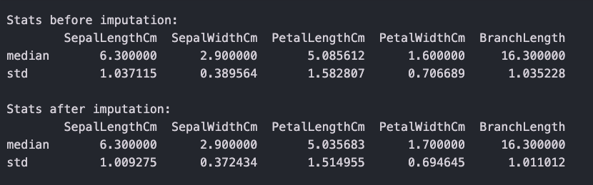

**Critical Implementation Note (Normalization):**
During the initial run using raw data, the model encountered a **`RuntimeWarning: overflow encountered in exp`** within the sigmoid activation function. This was caused by features with large scales (e.g., `AvgDust`) causing the weights to explode. 

As a result, a normalization step was added to scale all features to the `[0, 1]` range. This modification eliminated the numerical instability and allowed the model to achieve significantly higher accuracy (~72-74%).

### 1.2 Results: 5-Fold Grid Search
The model was evaluated across 16 combinations of Learning Rates {0.005, 0.01, 0.1, 0.5} and L2 Regularization parameters {1.0, 2.0, 4.0, 8.0}.

**Accuracy Grid (4x4 Table):**
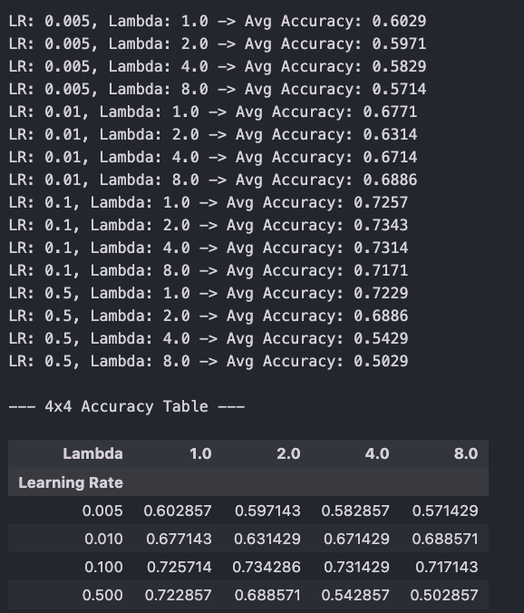

### 1.3 Final Evaluation (Top 2 Settings)
Based on the validation grid, the two best performing hyperparameter settings were selected for final testing on the unseen test set.

#### **Top Setting 1: Learning Rate 0.1, Lambda 2.0**
*   **Learning Curve:**
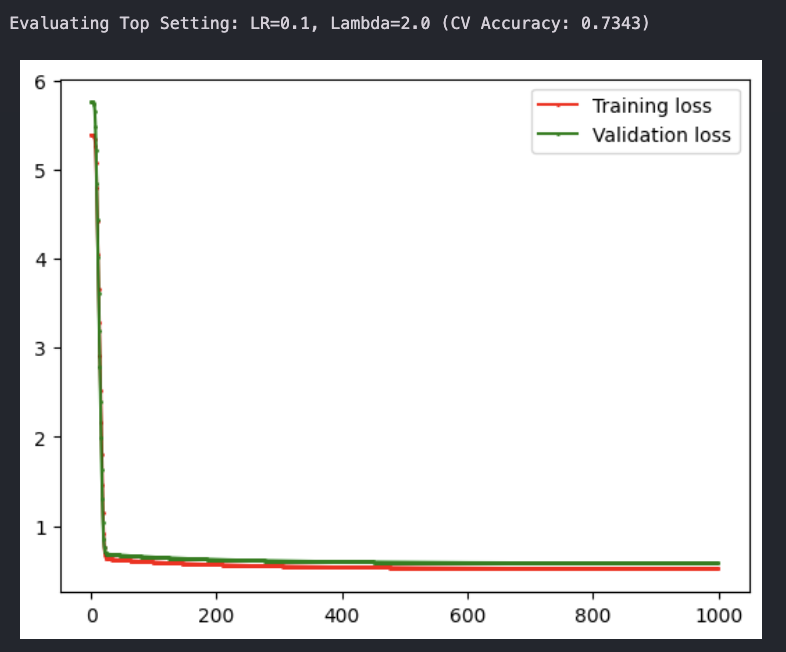
*   **Final Metrics (Test Set):**
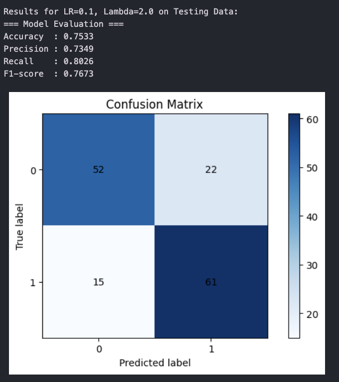

#### **Top Setting 2: Learning Rate 0.1, Lambda 4.0**
*   **Learning Curve:**
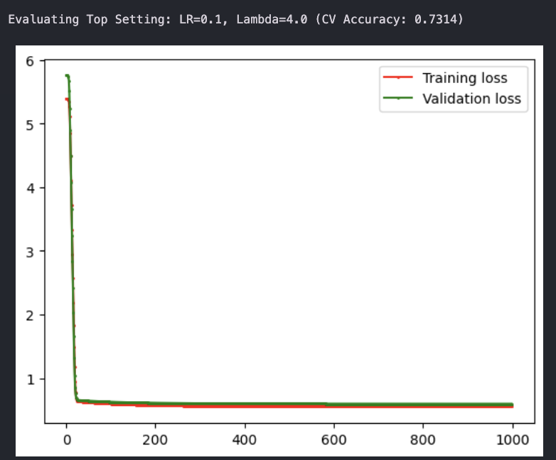
*   **Final Metrics (Test Set):**
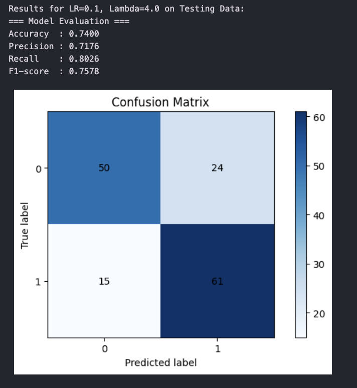

### 1.4 Observations

Based on the 5-fold cross-validation grid and the final evaluation on the testing data, several key observations can be made regarding the model's behavior:

* **The Learning Rate "Sweet Spot":** The cross-validation results (from the 4x4 grid) demonstrate that the learning rate is the primary driver of performance. A learning rate of 0.1 proved optimal, yielding the highest and most stable average accuracies (~71% to ~73%). Lower learning rates (0.005 and 0.01) likely resulted in underfitting or overly slow convergence within the epoch limit, capping accuracy around 57% to 68%.
* **Regularization Sensitivity at High Learning Rates:** While the model was relatively robust to changes in the L2 penalty (Lambda) at the optimal learning rate of 0.1, the combination of a high learning rate (0.5) and high regularization (Lambda = 4.0, 8.0) caused performance to severely degrade, dropping to ~50%. This suggests that making overly aggressive weight updates while simultaneously applying harsh weight penalties prevented the model from finding a viable minimum. 
* **Rapid Convergence and Generalization:** The learning curves for both top settings demonstrate rapid and stable convergence, with the loss flattening out efficiently within the first 50 to 100 epochs. Notably, the training and validation loss curves overlap almost perfectly. This indicates that the L2 regularization successfully prevented overfitting, allowing the model to generalize well to unseen data.
* **Test Performance vs. Validation:** Both top models performed exceptionally well on the unseen test set, actually slightly exceeding their cross-validation training averages (scoring 75.33% and 74.00% versus their CV averages of ~73%). 
* **Classification Nuances:** When comparing the Confusion Matrices of the top two models, both achieved the exact same Recall for Class 1 (80.26%, correctly identifying 61 instances). The distinction lies in their Precision; the model with the lighter penalty (Lambda = 2.0) was slightly better at predicting Class 0, resulting in fewer false positives (22 versus 24) and a marginally higher overall F1-score (0.7673 vs. 0.7578).
---

## 2. Support Vector Machine - Mobile Price (Task 2)

### 2.1 Data Splitting
The `mobile_price.csv` dataset was shuffled and split into Training (60%), Validation (20%), and Testing (20%) sets using a `random_state=42`.
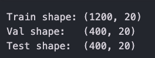

### 2.2 Baseline SVM (C=1.0)
A baseline SVM classifier was trained using the default regularization parameter $C=1.0$.
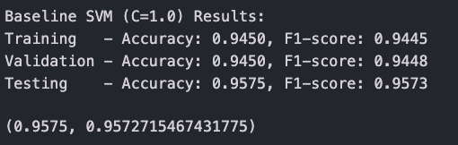

### 2.3 Hyperparameter Tuning (C-Value Exploration)
To optimize the model, various values for the regularization parameter $C \in \{0.001, 0.01, 0.1, 1, 10, 100, 1000, 10000\}$ were evaluated. The accuracy and F1-score for each set are visualized below.
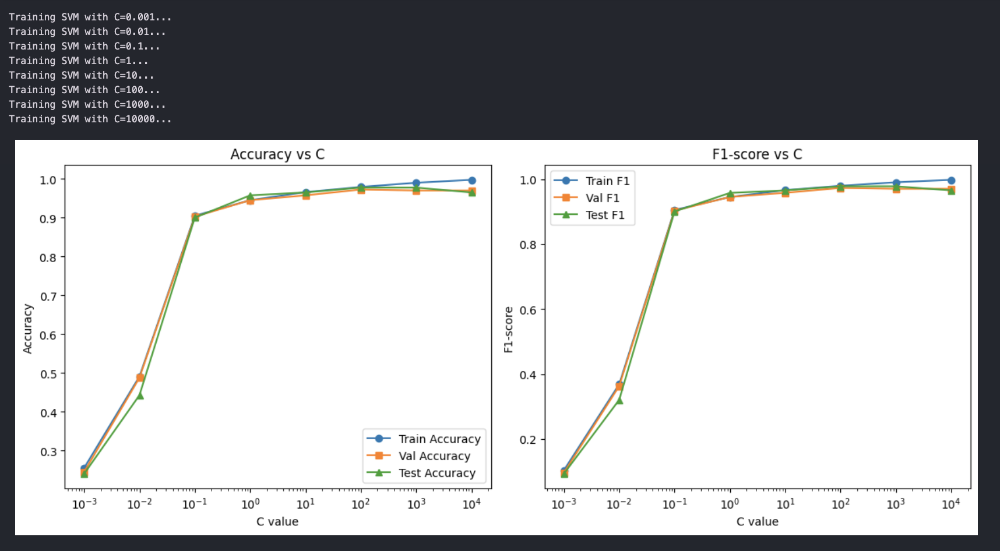

### 2.4 Observations and Generalization

Based on the visualization of the accuracy and F1-scores across the logarithmic scale of $C$, the model that provides the best generalization performance is **$C = 10$**. 

**Reasoning and the Bias-Variance Trade-off:**
The graphs perfectly illustrate the classic bias-variance trade-off associated with SVM regularization:

* **Underfitting (High Bias):** At very low values of $C$ (e.g., $10^{-3}$ and $10^{-2}$), the model imposes a massive penalty for complex decision boundaries, forcing an overly simplistic model. This results in severe underfitting, evidenced by the extremely low training, validation, and testing scores (starting around ~25% and ~50% respectively). The model is simply unable to capture the underlying patterns in the data.
* **The Optimal Sweet Spot ($C = 10$):** As $C$ increases, performance rapidly improves. The validation and test curves peak at $C = 10$, achieving an accuracy of approximately 96-97%. At this specific point, the training, validation, and testing lines are tightly clustered together. This minimal gap indicates that the model has successfully learned the true signal of the data without memorizing noise, resulting in excellent generalization to unseen data.
* **Overfitting (High Variance):** When $C$ is increased further ($10^2$, $10^3$, $10^4$), the regularization constraint becomes too weak, allowing the model to fit perfectly to the training data. We see the training curve (blue line) continue to climb until it hits a perfect $1.0$ (100% accuracy and F1-score). However, the validation and test curves detach from the training curve, plateauing and even slightly declining. This widening gap demonstrates that the model has begun to overfit—memorizing the specific noise and anomalies of the training set at the expense of its ability to generalize.
---

## 3. Association Rule Mining (Task 3)

### 3.1 Data Preprocessing and Discretization
The analysis focused on mid-range phones (`price_range = 1`). Four hardware features were selected: `ram`, `int_memory`, `px_width`, and `battery_power`. 

As per the requirements, the data was discretized into 'low', 'medium', and 'high' categories based on the **value range (max - min)** using a **3:4:3 ratio**. This ensures that the categories represent physical hardware tiers rather than simple data frequency percentiles.

### 3.2 Frequent Itemsets (Task 3a)
Using the FP-growth algorithm with a minimum support threshold of **0.3**, the following frequent itemsets were identified:
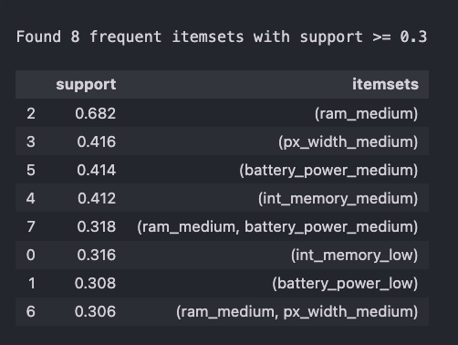

### 3.3 Association Rules (Task 3b)
Based on the frequent itemsets, association rules were generated using the criteria: support $\ge$ 0.3, confidence $\ge$ 0.4, and lift $\ge$ 0.8.
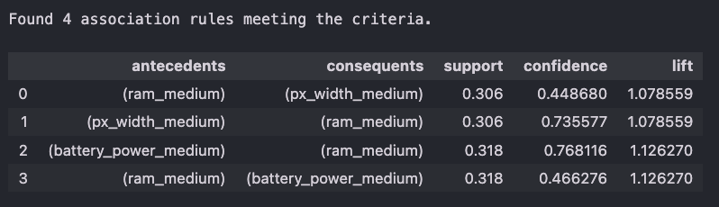

### 3.4 Observations

Based on the frequent itemsets and association rules extracted using the FP-growth algorithm, several defining characteristics of mid-range mobile phones (`price_range = 1`) become apparent:

* **The Dominance of "Medium" Specifications:** The frequent itemsets are heavily populated by the "medium" category. Most notably, **`ram_medium`** has an overwhelmingly high support of **0.682**, meaning nearly 70% of all mid-range phones in this dataset feature medium RAM capacity. Medium pixel width, battery power, and internal memory also show strong standalone support (all hovering around 0.41).
* **Presence of Lower-Tier Components:** Interestingly, while medium specs dominate, `int_memory_low` (support 0.316) and `battery_power_low` (support 0.308) also appear as frequent 1-itemsets. This suggests that manufacturers producing mid-range phones occasionally compromise on storage or battery capacity to keep costs down, while maintaining the crucial "medium" RAM.
* **Strong Confidence Directed Towards RAM:** The generated association rules reveal an interesting asymmetry. 
    * If a phone has `px_width_medium` or `battery_power_medium`, there is a high probability (confidence of **73.5%** and **76.8%**, respectively) that it also has `ram_medium`. 
    * Conversely, the reverse rules (predicting battery or pixel width based on having medium RAM) yield much lower confidences (~44% to 46%). This statistical behavior is directly driven by the massive base frequency of `ram_medium`. Because medium RAM is practically a standard baseline for this price tier, other medium-tier features naturally co-occur with it frequently.
* **Positive, but Moderate Correlation (Lift):** All four rules exhibit a Lift value strictly greater than 1.0 (ranging from **1.07** to **1.12**). A lift greater than 1 indicates a positive correlation—meaning the items in the antecedents and consequents appear together more often than would be expected if they were statistically independent. However, because these lift values are relatively close to 1, the positive association is moderate rather than overwhelmingly strong, reflecting the generally standard, uniform hardware configurations found in this specific price segment.
---

## 4. PCA and K-Means (Task 4)

### 4.1 Standardization and Dimensionality Reduction
The mobile price dataset was standardized using z-score normalization (`StandardScaler`). Subsequently, the feature space was projected onto two dimensions using Principal Component Analysis (PCA).

**PCA Visualization:**
The scatter plot below visualizes the first two principal components, with colors representing the original class labels (`price_range`).
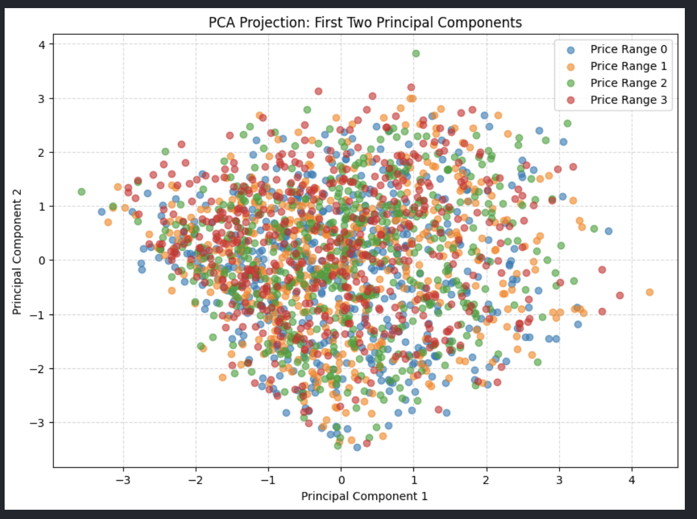

### 4.2 K-Means Clustering: Full Features vs. PCA
K-Means clustering ($K=4$) was performed using two approaches: all features and the 2D PCA-transformed features. Performance was measured using the **Adjusted Rand Score (ARS)**.

**Approach 1: Clustering on All Features**
Clustering was performed on the full standardized feature matrix.
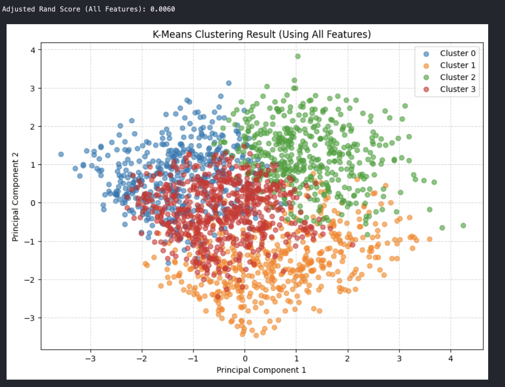

**Approach 2: Clustering on PCA 2D Features**
Clustering was performed on the 2D subspace defined by the first two principal components.
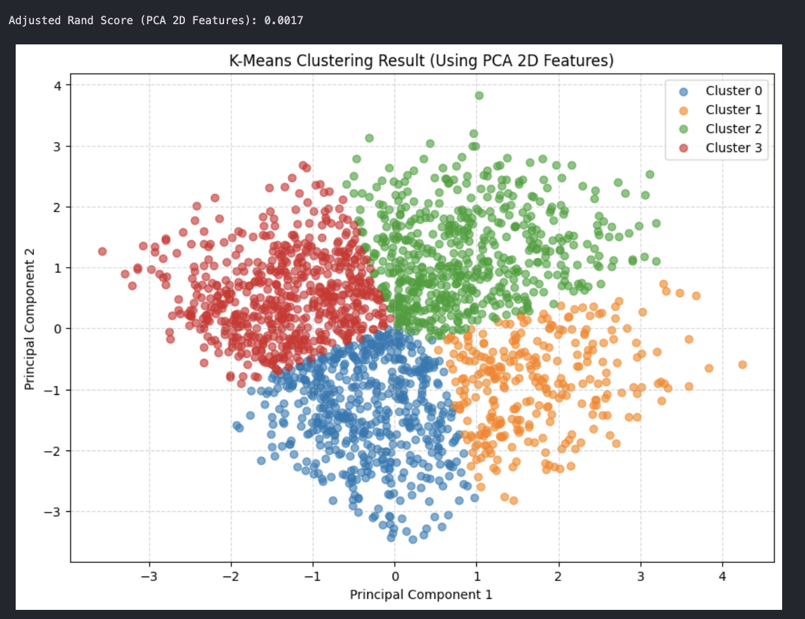

### 4.3 Observations

Based on the visualizations and the Adjusted Rand Scores (ARS), several critical insights can be drawn regarding the dataset's structure and the effectiveness of unsupervised clustering for this specific problem:

* **Poor Natural Separability:** The initial PCA projection of the true labels reveals that the four price ranges overlap almost entirely within the subspace of the first two principal components. This indicates that the most significant directions of overall variance in the dataset do *not* correspond to the price tiers. The classes are not easily separable using simple linear combinations of features.
* **Failure of Unsupervised Clustering:** The Adjusted Rand Score (ARS) measures the similarity between the clustering results and the ground truth labels, with a score near 0.0 indicating practically random assignments. Both K-Means approaches yielded abysmal scores (**0.0060** and **0.0017**). This demonstrates that mobile price tiers do not form natural, cohesive groupings based on Euclidean distance in the feature space. Predicting price range requires supervised learning (like the SVM used in Task 2) rather than unsupervised spatial clustering.
* **The Impact of Dimensionality Reduction:** * **Clustering on All Features (ARS = 0.0060):** When K-Means operates on the full high-dimensional space, the resulting clusters look somewhat scattered and overlapping when forced into a 2D projection. It retains slightly more of the dataset's true structure, resulting in a marginally higher (though still poor) ARS.
    * **Clustering on PCA 2D Features (ARS = 0.0017):** When K-Means is restricted strictly to the 2D PCA data, the algorithm simply divides the dense 2D blob into four neat, geometric quadrants. While this looks visually "cleaner" in the scatter plot, it completely ignores the variance from the discarded dimensions. Consequently, this method loses critical information and performs even worse in matching the true price ranges.
---

## 5. Enhancing K-Means with Association Rule Mining (Task 5)

### 5.1 Proposed Method: Feature Weighting via ARM
To improve K-Means clustering, a framework was designed to weight features based on their predictive power derived from Association Rule Mining (ARM).

**Inspiration:**
Standard K-Means assumes all features contribute equally to cluster formation. However, in the mobile price dataset, certain hardware features (like `ram`) are far more influential than others. By using ARM to identify which feature-value pairs strongly imply a specific `price_range`, we can calculate "Importance Weights" to stretch the feature space along relevant dimensions.

**Design Details:**
1.  **Robust Discretization:** Features were discretized into categories using a quantile-based approach that handles duplicate values.
2.  **Target-Driven Rule Mining:** Transactions were formed by combining discretized features with the target `price_range`. FP-growth was used to find rules where the consequent is a price tier.
3.  **Lift-Based Weighting:** Each feature's weight was calculated by aggregating the **Lift** of rules it participated in. Features with higher lift values (indicating stronger association with price tiers) received higher weights.
4.  **Weighted K-Means:** The standardized feature matrix was multiplied by these weights before clustering.
5.  **Hungarian Algorithm Mapping:** Since clustering IDs are arbitrary, the Hungarian algorithm was used to find the optimal 1-to-1 mapping between clusters and true price labels for valid metric calculation.

### 5.2 Baseline Performance
The performance of the original K-Means algorithm was averaged over the seeds: `[0, 10, 42, 100, 999]`.
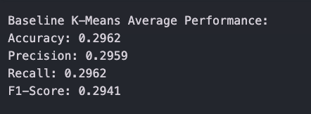

### 5.3 Enhanced Method Results
The results of the robust discretization and the subsequent weighted clustering are shown below.

**Discretization results:**
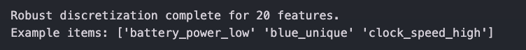

**Feature Weights and Enhanced Metrics:**
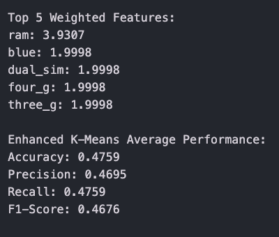

### 5.4 Performance Comparison
The plot below compares the average performance of the Baseline vs. the Enhanced method across Accuracy, Precision, Recall, and F1-score.
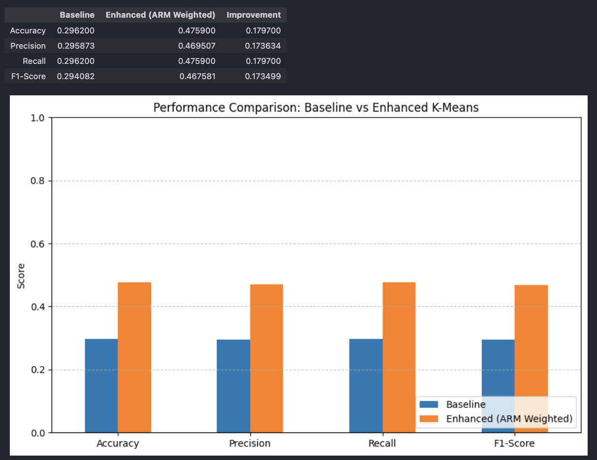

### 5.5 Final Analysis

The integration of Association Rule Mining (ARM) to weight features prior to clustering resulted in a significant and measurable improvement over the baseline algorithm.

* **Substantial Performance Gains:** The baseline K-Means algorithm performed only slightly better than random guessing, hovering around **29.6%** across all metrics (Accuracy, Precision, Recall, F1-score). By applying the ARM-derived feature weights, performance jumped to approximately **47.6%**. This represents an absolute increase of ~18% and a relative improvement of over 60%. While an accuracy of 47% confirms that purely distance-based unsupervised clustering still struggles to perfectly recreate complex pricing tiers (compared to the 96% accuracy of the supervised SVM in Task 2), the enhancement is undeniably effective.
* **Overcoming the Curse of Dimensionality:** Standard K-Means relies on Euclidean distance, treating all 20 features with equal importance. In a dataset where many features are likely noisy or irrelevant to the final price, the distance calculations become diluted. The ARM weighting acts as an automated, data-driven feature scaling mechanism. By "stretching" the feature space along the axes that strongly associate with price and "shrinking" the irrelevant axes, the Euclidean distance algorithm is forced to group phones based on the features that actually matter.
* **Validation of Domain Knowledge:** The ARM methodology correctly identified `ram` as the most influential feature by a wide margin (weight of **3.93**). This aligns perfectly with real-world consumer electronics pricing, where memory capacity is the primary differentiator between budget, mid-range, and flagship devices. 
* **The Binary Feature Artifact:** It is worth noting the behavior of the secondary features (`blue`, `dual_sim`, `four_g`, `three_g`). All four received an identical weight of **1.9998**. Because these are all binary (0 or 1) features, this uniformity suggests a mathematical artifact in how the Lift was aggregated during the rule mining phase for variables with only two distinct states. Even so, the weighting system successfully prioritized these connectivity and design features over continuous features that may have possessed high variance but low actual correlation with the target price.
